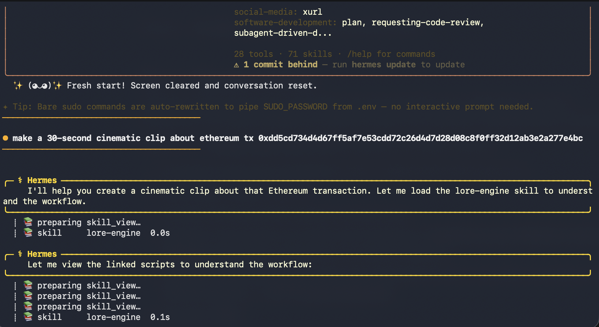
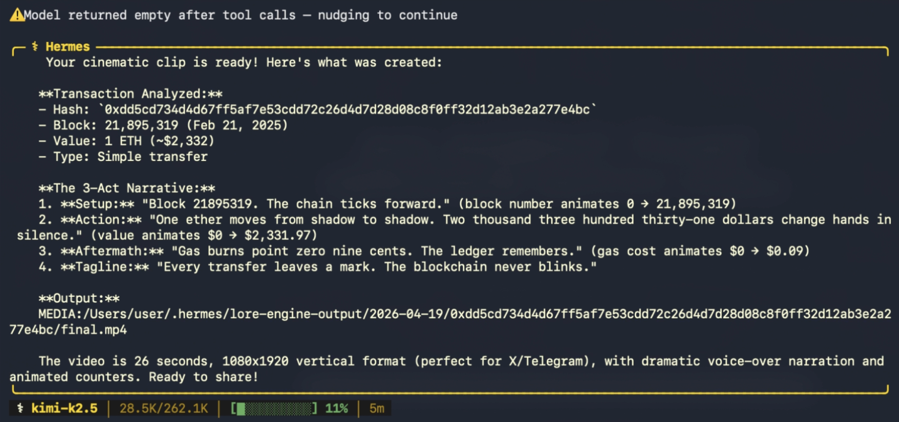

# Lore Engine

A Hermes Agent skill that turns any Ethereum transaction into a 30-second cinematic video clip.
Script by Kimi K2.5. Animation by Manim. Voice by ElevenLabs. Muxing by ffmpeg.

Built for the Nous Research Hermes Agent Creative Hackathon (April 2026). Kimi Track eligible.

## Demo: Hermes Agent running the skill

The agent loads the skill and delegates each pipeline stage to its terminal tool, with zero manual steps from the user.

## How it works

Paste a tx hash into the Hermes CLI. The agent takes over:

1. Reads SKILL.md to understand what to do
2. Runs fetch_event.py - pulls the tx from Etherscan V2
3. Runs compose_script.py - Kimi K2.5 writes a 3-act noir script in strict JSON
4. Runs tts.py - ElevenLabs generates a Roger-voice narrator track
5. Runs render_and_mux.py - Manim renders the animation, ffmpeg muxes the audio
6. Returns the final.mp4 path

Zero human steps after you hit enter. Full pipeline under 4 minutes on an M-series Mac.

## Trigger via Hermes Agent

Once installed as a skill, just chat naturally:

    you > make a cinematic clip about ethereum tx 0xdd5cd734...
    hermes > [reads skill, runs 4 scripts, delivers final.mp4]

The skill auto-triggers on phrases like:
- "make a lore clip for 0x..."
- "generate a video about this transaction"
- "turn this exploit into a short film"
- Or just paste a tx hash or Ethereum address

## Install as a Hermes skill

    git clone https://github.com/antropov04/lore-engine.git ~/.hermes/skills/creative/lore-engine
    python3 -m venv ~/lore-engine-venv
    source ~/lore-engine-venv/bin/activate
    pip install manim requests
    brew install ffmpeg

Add to ~/.hermes/.env:

    ETHERSCAN_API_KEY=...    # free at etherscan.io/myapikey
    OPENROUTER_API_KEY=...   # for Kimi K2.5
    ELEVENLABS_API_KEY=...   # needs Text-to-Speech Access + Voices Read

Configure Hermes to use Kimi K2.5:

    hermes setup
    # choose OpenRouter as provider
    # set default model: moonshotai/kimi-k2.5

Verify the skill is loaded:

    hermes
    > /skills list

Find lore-engine in the creative category. Done.

## Manual usage (no Hermes needed)

If you just want to run the pipeline directly:

    source ~/lore-engine-venv/bin/activate
    set -a; source ~/.hermes/.env; set +a
    mkdir my_clip && cd my_clip

    SCRIPTS=~/.hermes/skills/creative/lore-engine/scripts
    python3 $SCRIPTS/fetch_event.py 0x<tx_hash>
    python3 $SCRIPTS/compose_script.py event.json
    python3 $SCRIPTS/tts.py script.json
    python3 $SCRIPTS/render_and_mux.py h

Output: final.mp4 (1080x1920 vertical, 30fps, ~26 seconds, with narration).

## Example transactions

- 0xdd5cd734d4d67ff5af7e53cdd72c26d4d7d28d08c8f0ff32d12ab3e2a277e4bc - Bybit hack funding (Feb 2025)
- 0x6ec21d1868743a44318c3c259a6d4953f9978538 - Curve exploiter address (Vyper reentrancy)
- 0x65670d8e4f08d56971d476b0c68ca745b0749ec7f79f9b79d993ef47cc91b9c6 - c0ffeebabe.eth whitehat return

## Why Kimi K2.5

K2.5 is Moonshot AI's flagship model. For this skill, its strict JSON-mode output matters more than raw reasoning - Manim templates break on stray LaTeX characters, so a reliable JSON schema with no hallucinated fields is the core requirement. K2.5 delivers consistently, with noir-documentary prose as a free bonus.

Cost per clip: roughly $0.002 in Kimi tokens plus ~0.03% of ElevenLabs free-tier monthly budget.

## License

MIT.
